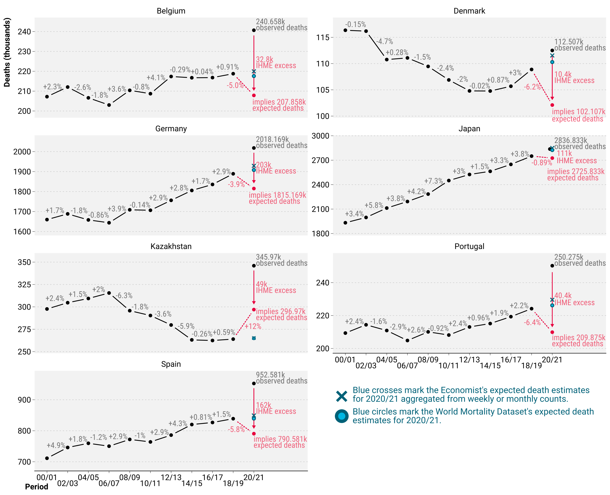

# Validation of Excess Mortality Estimates by Wang etal. (2022)

[00116--2-brightgreen?style=flat-square>)](<https://doi.org/10.1016/S0140-6736(23)00116-2>)

Jonas Schöley, Ariel Karlinsky, Dmitry Kobak, Charles Tallack

- `doc/supplementary_table_1.ods`: The data to recreate the figure below can be found in tab `comparison_biannual`
- `src/01-ihme_comparison.R`: code to replicate the figure below

